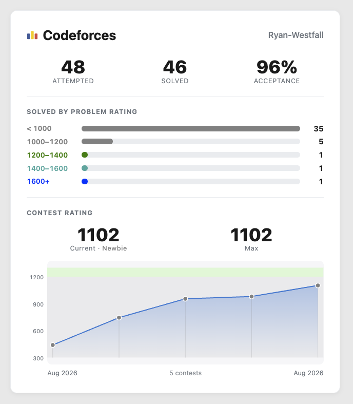

# codeforces-stats-card

A self-contained **React** card that displays a [Codeforces](https://codeforces.com)
user's problem-solving stats and contest-rating history. Just pass a handle — it
fetches everything from the public Codeforces API and ships its own styles, so
there's nothing else to wire up.

<p align="center">
  
</p>

## Features

- 🔢 **Attempted / solved / acceptance** counts from the user's submissions
- 📊 **Solved-by-rating distribution** — five numeric ranges (aligned to Codeforces
  rank thresholds) that automatically center on the user's current rating, with
  unbounded `< X` and `X+` ends so every solved problem is counted
- 🎖️ **Current & max rating** with the rank name colored by its Codeforces tier
- 📈 **Contest-rating graph** with rating-tier color bands, a per-contest marker
  for every competition, and a hover tooltip showing the contest name, rank,
  rating change, and date
- 🎨 Zero CSS imports — styles self-inject once into `<head>`
- 📦 No runtime dependencies beyond React (peer dependency)

## Install

From npm:

```bash
npm install codeforces-stats-card
# or
bun add codeforces-stats-card
```

Or straight from GitHub (no npm account needed):

```bash
bun add github:Ryan-Westfall/codeforces-stats-card
# or
npm install github:Ryan-Westfall/codeforces-stats-card
```

React 17+ is a peer dependency.

## Usage

```jsx
import { CodeforcesCard } from 'codeforces-stats-card';

export default function App() {
  return <CodeforcesCard handle="Ryan-Westfall" />;
}
```

That's it. The card fetches the user's info, rating history, and submissions,
then renders the stats and rating graph. It's designed to fill its container, so
give it a sized wrapper (e.g. a grid/flex cell) to control its footprint.

## Props

| Prop             | Type                 | Default        | Description                                                              |
| ---------------- | -------------------- | -------------- | ------------------------------------------------------------------------ |
| `handle`         | `string`             | **(required)** | The Codeforces handle to display.                                        |
| `title`          | `string`             | `'Codeforces'` | Card heading text.                                                       |
| `showRank`       | `boolean`            | `true`         | Show the rank name next to the current rating.                           |
| `maxSubmissions` | `number`             | `10000`        | How many recent submissions to scan when counting distinct solved problems. |
| `className`      | `string`             | `''`           | Extra class names for the root element.                                  |
| `style`          | `React.CSSProperties`| —              | Inline styles for the root element.                                      |

## Styling

Styles are injected once into `<head>` under `#cfsc-styles`. Everything is scoped
to the `.cfsc-*` class namespace. You can override the look via CSS variables on
`.cfsc-card`, e.g.:

```css
.cfsc-card {
  --cfsc-line: #e43e3e;   /* rating line + area color */
  --cfsc-bg: #fbfbfb;
}
```

## Data source

All data comes from the public [Codeforces API](https://codeforces.com/apiHelp):
`user.info`, `user.rating`, and `user.status`. No API key required. The Codeforces
API sends permissive CORS headers, so this works from the browser.

## License

MIT © Ryan Westfall
